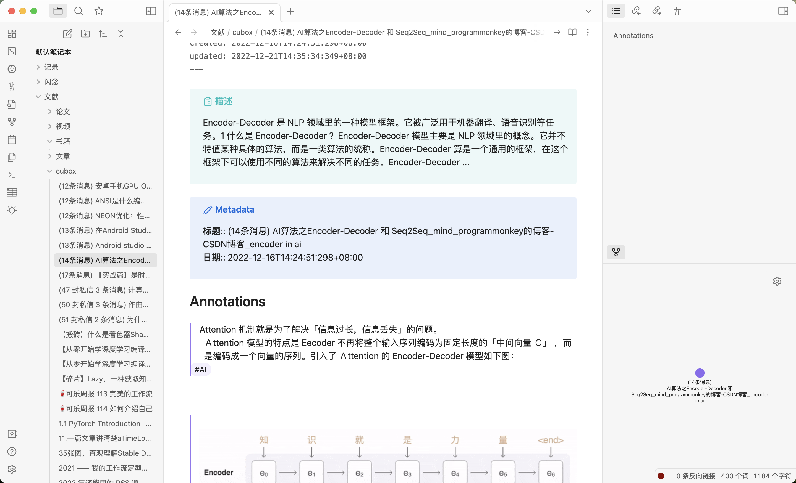
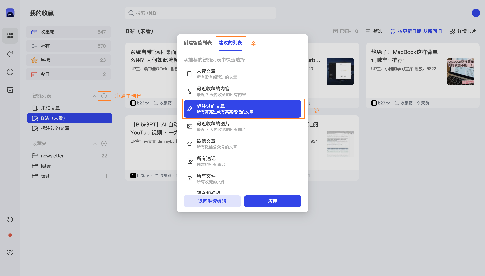
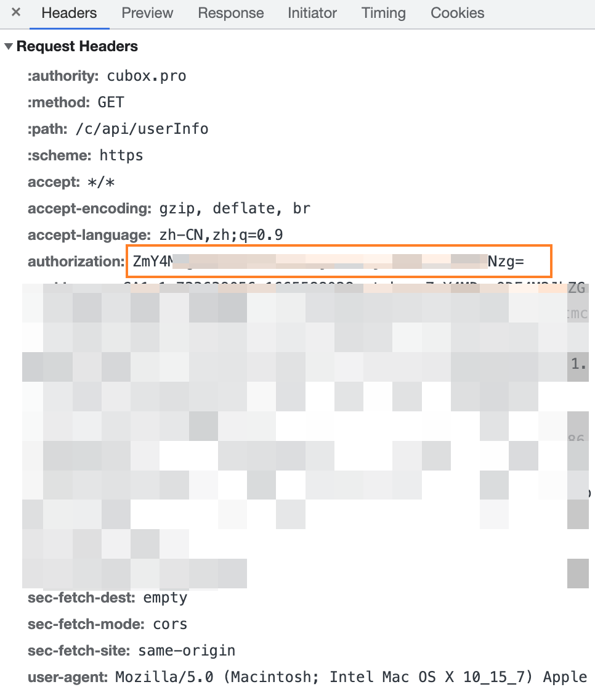
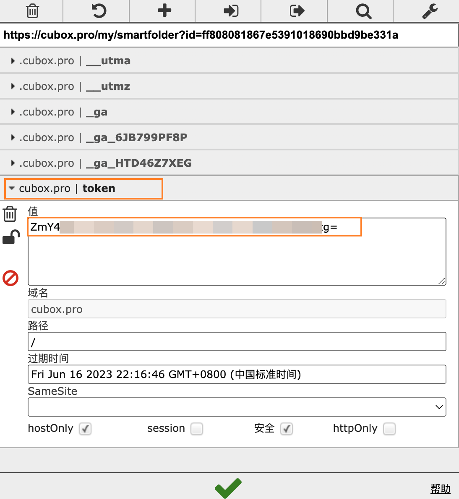
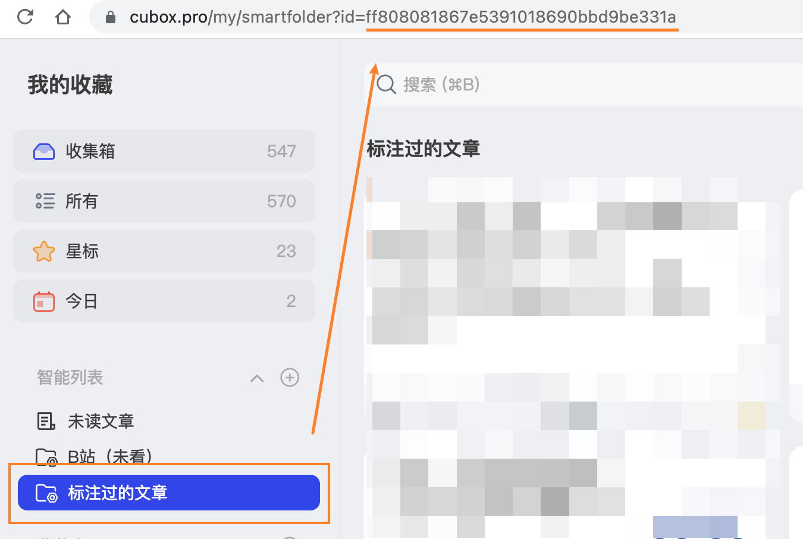

# cubox2obsidian
> 同步 Cubox 上的笔记到 Obsidian（Sync notes from Cubox to Obsidian）

一键将 Cubox 上的高亮标注和笔记同步到 Obsidian 中。

## Getting Started 使用指南

1. 在 Cubox 上创建一个「标注过的文章」智能清单（用于过滤出有标注的文章，程序直接请求这个清单中的文章）
   
2. 修改 config_template.py 中的配置，然后将其重命名为 config.py，其中的配置项：
   - token：Cubox 的 token，可以 F12 从请求中获取，也可以使用 EditThisCookie 插件获取
     
     
   - aisearchId：智能清单的 id，点击进入第一步中创建的智能清单，然后从 url 中获取
     
   - sync_directory: Obsidian 中的笔记文件夹路径
   - article_template: 笔记模板，有需要可以自行修改
3. `python main.py` 运行程序

## Release History 版本历史

* 0.1
    * 基本功能实现

## License 授权协议

这个项目 Apache License 2.0 - 详见 [LICENSE](LICENSE) 文件